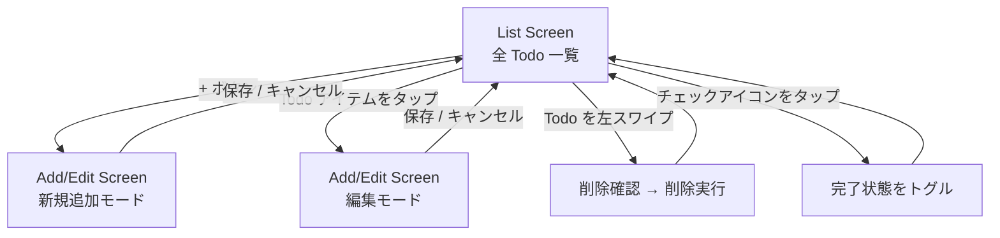
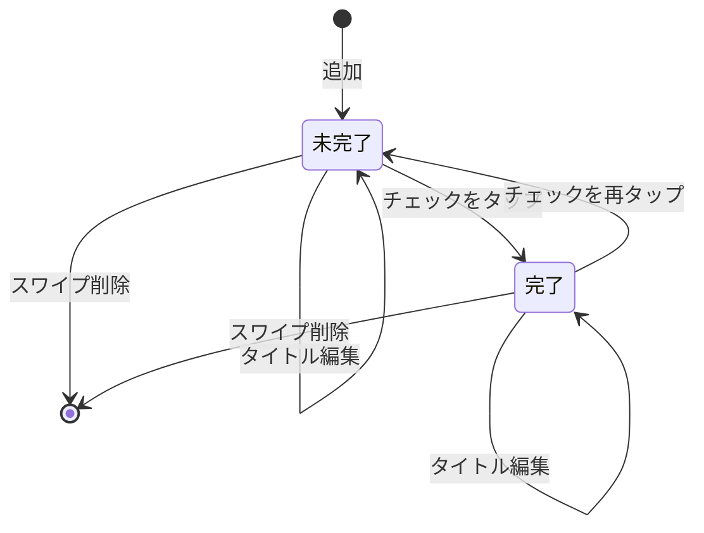

# Todo アプリ 機能設計

## 機能一覧

| # | 機能名 | 概要 | 対応画面 |
| --- | --- | --- | --- |
| 1 | Todo 一覧表示 | 登録済み Todo をリスト表示。完了済みは打ち消し線で区別 | List Screen |
| 2 | Todo 追加 | タイトルを入力して新規 Todo を保存。空文字は保存不可 | Add/Edit Screen |
| 3 | Todo 編集 | 既存タイトルを変更して保存 | Add/Edit Screen |
| 4 | 完了トグル | チェックで completed 状態を切り替え、AsyncStorage に反映 | List Screen |
| 5 | スワイプ削除 | 左スワイプで Todo を削除。AsyncStorage から削除 | List Screen |
| 6 | データ永続化 | AsyncStorage に保存し、アプリ再起動後も維持 | — |

---

## 画面フロー

---

## 状態遷移（Todo アイテム）

---

## ビジネスルール

| # | ルール | 条件 | 結果 | 違反時の挙動 |
| --- | --- | --- | --- | --- |
| 1 | 空文字保存禁止 | タイトルが空または空白のみ | 保存不可 | 保存ボタンを非活性またはバリデーションエラー表示 |
| 2 | ID の一意性 | Todo 追加時 | `crypto.randomUUID()` で UUID を生成 | — |
| 3 | 作成日時の記録 | Todo 追加時 | `new Date().toISOString()` で createdAt を付与 | — |
| 4 | 全件一括保存 | CRUD 操作後 | Todo 配列全体を JSON 化して AsyncStorage に上書き | — |

---

## 画面・操作マッピング

| 画面 | 操作 | 呼び出す useTodos 関数 | AsyncStorage |
| --- | --- | --- | --- |
| List Screen | 初期表示 | `loadTodos()` | 読み取り |
| List Screen | チェックをタップ | `toggleTodo(id)` | 書き込み |
| List Screen | スワイプ削除 | `deleteTodo(id)` | 書き込み |
| Add/Edit Screen | 保存（新規） | `addTodo(title)` | 書き込み |
| Add/Edit Screen | 保存（編集） | `updateTodo(id, title)` | 書き込み |
